Diziler --> Bağlı Listeler (Linked List) --> Kuyruklar (Queues) --> Yığınlar 

## Diziler

Dizi (array), aynı tipteki verilerin tek bir değişken altında tutulmasını sağlayan veri yapısıdır. Sabit bir değere
sahip olan dizinin uzunluğu, dizi oluşturulurken belirlenir. Bir dizide bulunan verilerin her biri, o dizinin
bir elemanı olarak adlandırılıyor. İndis --> 0 --> dizinin uzunluğunun 1 eksiğine kadar ardışık olarak artarak devam eder.

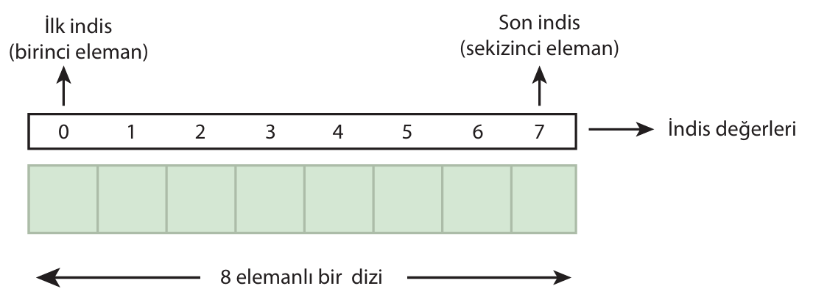

Diziler tek veya çok boyutlu olabilir.

dizi-tipi dizi-adi [ dizi-uzunlugu ];

int tamSayiDizisi[10];
char karakterDizisi[20];

### Dizilere Değer Atama

Bir diziyi veri tipip, isim ve kapasite belirterek tanımaldığımızda bilgisayar hafızasında dizi için bir yer atırır; fakat dizi elamanlarına bir değer ataması yapılmaz.

```c
#include <stdio.h>
#include <conio.h>

int main(void)
{
    int dizi[6];

    int i;

    for (i = 0; i < 6; i++)
    {
        dizi[i] = 0;
        printf("dizi[%d] = %d\n", i, dizi[i]);
    }
    
    getch();
    return 0;
}
```

```C
#include <stdio.h>
#include <conio.h>

#define N 5 

int main(void)
{
    int dizi1[N] = {1, 2, 3, 4, 5};
    int dizi2[N] = {1, 2};

    int i;

    for (i = 0; i < N; i++)
    {
        printf("dizi1[%d] = %d\t", i, dizi1[i]);
        printf("dizi2[%d] = %d\n", i, dizi2[i]);
    }
    
    getch();
    return 0;
}
```

### Çok Boyutlu Diziler

### İki Boyutlu Diziler

Satır ve sütunlardan oluşan tablolar şeklinde tanımlanabilen iki boyutlu diziler, çok boyutlu en yalın halidir. m adet satır, n adet sütundan oluşan iki boyutlu bir dizi, toplam (m x n) elemana sahip olabilir. 

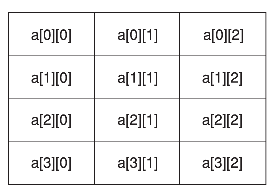

İki boyutlu dizilerin elemanlarına değer atarken, her iki boyuttaki indisler üzerinde dolaşılmalıdır. Bu gereksinim için iç içe geçmiş 2 adet for döngüsü kurulabilir.

```C
#include <stdio.h>
#include <conio.h>

#define M 4
#define N 3

int main(void)
{
    int dizi[M][N] = { {1, 2, 3}, {4, 5, 6}, {7}, {8, 9, 10} };

    int i, j;

    for (i = 0; i < M; i++)
    {
        for (j = 0; j < N; j++)
        {
            printf("dizi[%d][%d] = %d\n", i, j, dizi[i][j]);
        }
        
    }
    
    
    getch();
    return 0;
}
```

### Üç Boyutlu Diziler

Üç boyutlu diziler, iki boyutlu dizilerin katmanlar halinde bir araya gelmesiyle oluşur. "İKİ BOYUTLU DİZİLERİN DİZİSİ". Boyut uzunlukları sırasıyla a, b, c olan üç bouyutlu bir dizinin sahip olacağı toplam eleman sayısı a.b.c kdar olur.

Üç boyutlu dizilerde dizi tanımlama ve elemanlara değer atama işlemleri iki boytulu dizilerdeki işlemlere benzerlik gösterir. Üç boyutlu dizilerin elemanları gezilirken, iç içe geçmiş 3 adet for döngüsü kullanılabilir.

```C
#include <stdio.h>
#include <conio.h>

int main(void)
{
    int d[3][2][2] = {12, 11, 10, 9, 8, 7, 6, 5, 4, 3, 2, 1};

    int i, j, k;

    for (i = 0; i < 3; i++)
    {
        for (j = 0; j < 2; j++)
        {
            for (k = 0; k < 2; k++)
            {
                printf("%d\n", d[i][j][k]);
            }
            
        }
        
    }
    
    
    
    getch();
    return 0;
}
```

----


## Bağlı Listeler (Linked List)

Bağlı Liste (linked list), aynı türden nesnelerin doğrusal bir sırada ve birbirlerine bğalı şekilde saklandığı veri yapısıdır. Bağlı listedeki nesnelere düğüm (node) adı verilir ve düğümler birbirlerine bir sonraki düğümü işaret eden göstericiler (next pointer) araclığıyla bağlanmışlardır. Ayrıca bağlı listelerde listenin başlangıcını işaret eden bir baş gösterici (head pointer) de bulunur.

Bağlı Listeleri oluşturan düğümler genellikle iki kısımdan meydana gelir. Düğümün ilk kısmında veri saklanırken, ikinci kısmında bir sonraki düğümün bilgisayar hafızasındaki yeri saklanır:

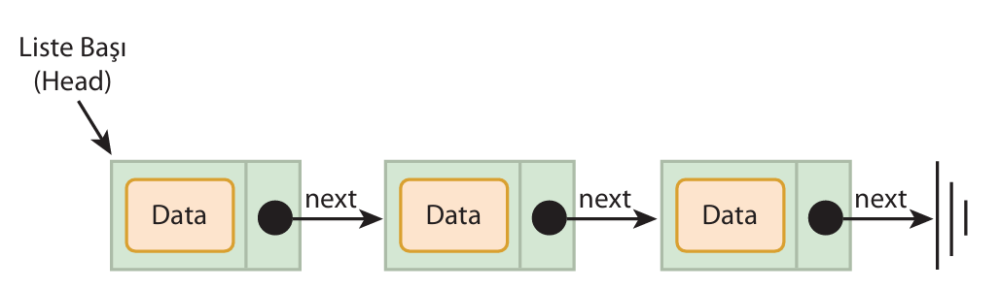

### Bağlı Listeler ile Dizilerin Karşılaştırılması

- Veri Yapısı Uzunluğu: Dizilerde veri yapısının uzunluğu sabittir, gerekli durumlarda dizi uzunluğu arttırılamaz veya azaltılamaz. Bağlı listelerde uzunluk dinamiktir yeni nesneler eklenebilir, var olan nesneler silinebilir.

- Hafıza Kullanımı: Bağlı lsitelerdeki her bir nesnenin göstericisi için, memory'de yer ayrılması gerekir. Dizilerde böyle bir duurm söz konusu değildir. 

- Veri ekleme/silme maliyeti: Dizilerde ekleme ve çıkarma işlemleri programlama açısından oldukça yüksek maliyetlidir. Bağlı listelerde ekleme veya çıkarma yapmak, dizilerdekine göre daha az maliyetli ve kolaydır. 

- Verilere Doğrudan Erişim: Dizi elemanlarına indisler aracılığyla doğrudan erişilebilir. Bağlı listelerde ise böyle bir durum söz konusu değildir. Bağlı lsitenin bir elemanına erişmek için o elemanın listede aranması ve bulunması gerekir.

### Bağlı Liste Türleri

Bağlı listelerin elemanları dolaşırken ileriye doğru gitmek, geri doğru hareket etmek ve listenin sonundan listenin başına erişmek mümkün olabikir. Belirtilen bu hareket kabiliyetleri çeşitli türlkerde bağlı lsitelerin ortaya çıkmasına nedne olur. 

- Tek Yönlü Bağlı Liste (Singly Linked List)
- Çift Yönlü Bağlı Liste (Doubly Linked List)
- Dairesel Bağlı Liste (Circular Linked List)

### Tek Yönlü Bağlı Liste

Liste düğümleri arasındaki gezinme yalnızca ileriye doğru gerçekleşir.


### Çift Yönlü Bağlı Liste

Liste düğümleri arasında hem ileriye hem de geriye doğru gidilebilir. Çift yönli bağlı listenin bir düğümü, bir sonraki düğümü işaret eden göstericinin (next pointer) yanı sıra, bir önceki düğümü işaret eden gösterici (previous pointer) de içerir.

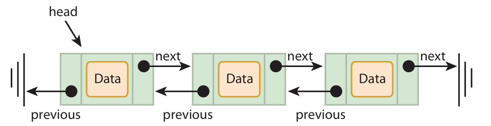

### Dairesel Bağlı Liste

Bir bağlı listenin son düğümünün bir sonraki düğümü işaret eden göstericisi (next pointer) listenin ilk düğümünü işaret ettiğinde liste dairesel hale gelmiş olur. Bağlı listelerin bu çeşidine dairesel bağlı liste denilmektedir.

Gerek tek yönlü gerek çift yönlü bağlı listelerin dairesel hale getirilmesi mümkündür. 

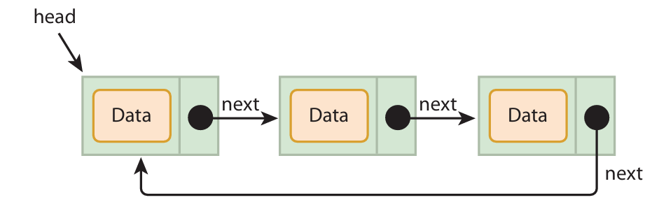

### Bağlı Listelerde Temel İşlemler

- Listeye Yeni eleman ekleme
- Listeden eleman çıkarma
- Listedeki toplam eleman sayısını bulma
- Listenin elemanlarını dolaşma
- Listede eleman arama
- Listenin ilk veya son elemanını bulma

#### Düğüm (Node) Yapısını Oluşturma

- Veri (data)
- Bir sonraki düğümün göstericisi (next pointer)

```c
struct Node {
    int data;
    struct Node* next;
};

struct Node* head = NULL;

```

#### Listeye Eleman Ekleme (Insertion)

Ekleme işleminde, eklenecek düğüm için malloc fonksiyonu ile hafızada yer açılır. Listenin başına ekleme yapalım:

```c 
void insert(int a)
{
    struct Node *t = (struct Node *)malloc(sizeof(struct Node));

    t->data = a;

    t->next = head;
    head = t;
}
```

#### Listeden Eleman Çıkarma (Deletion)

Çıkarma işleminde çıkarılacak düğüm, free fonksiyonu ile hafızadan silinir. Çıkarma işlemi listenin ara bir bölgesinden yapılacaksa, öncelikle çıkarılacak düğüm liste içerisinde bulunmalı, düğüm bulunduktan sonra çıkarma işlemi gerçekleştirilmelidir. Bağlı listelerde çıkarma işlemini baş taraftan yapan fonksiyon:

```c
void delete()
{
    if(head != NULL)
    {
        struct Node *t = head;

        head = head->next;
        free(t);
    }
}
```

#### Listeyi Gezinme (Traversal)

Bağlı listenin elemanlarını gezinmek, listenin başındna sonuna kadar gitmek demektir. Gezinme işlemi, listenin son elemanına ulaşılıncaya kadar, yani bir sonraki düğümü işaret eden göstericisi (next pointer) NULL olan eleman bulunana kadar devam eder. Listenin elemanların gezinlirken, listede eleman arama veya elemanları ekrana yazdırma gibi işlemler de yapılabilir.

```C
void traverse()
{
    struct Node* t = head;

    while(t != NULL)
    {
        printf("%d ", t->data);
        t = t->next;
    }
}
```

Tüm Kod:

```C
#include <stdio.h>
#include <conio.h>
#include <stdlib.h>

struct Node {
    int data;
    struct Node* next;
};

struct Node* head = NULL;

void insertToHead(int a)
{
    struct Node *t = (struct Node *)malloc(sizeof(struct Node));

    t->data = a;
    t->next = head;
    head = t;
}

void deleteFromHead()
{
    if(head != NULL)
    {
        struct Node *t = head;
        head = head->next;
        free(t);
    }
}

void printList()
{
    struct Node* t = head;

    while(t != NULL)
    {
        printf("%d -> ", t->data);
        t = t->next;
    }
}

int main()
{
    int i, j;

    for (i = 1; i < 10; i++)
    {
        insertToHead(i);
    }

    printList();
    printf("\n");

    for (j = 0; j < 4; j++)
    {
        deleteFromHead();
    }
    
    printList();
    getch();
    
}
```

### ÖDEV

- Linked List'in kullanım alanlarını araştır.
- Doubly Linked List'i implemente etmeye çalış.
- Circular Linked List'i implemente etmeye çalış.

-----------------------------------------------------------

## Kuyruklar (Queues)

Günlük hayattaki bu kuyruk mantığı, programlamada da yer almaktadır. Programlamada kuyruk (queue), verilerin doğrusal sırada tutulmasını sağlayan bir veri yapısıdır. Bir kuyruğun başı (front) ve sonu (rear) bulunur. Kuyruk yapısındaki temel işlemler olan ekleme (enqueue) son taraftan, çıkarma (dequeue) ise baş taraftan gerçekleştirilir. Dolayısıyla kuyruğa ilk giren eleman, kuyruktan ilk çıkan eleman olur. (FIFO)

FIFO (First-In First-Out): Programlamada kuyruklar FIFO kuralı ile anılıyor. Bu ifade "İlk giren İlk Çıkar" şeklinde tercüme edilir.

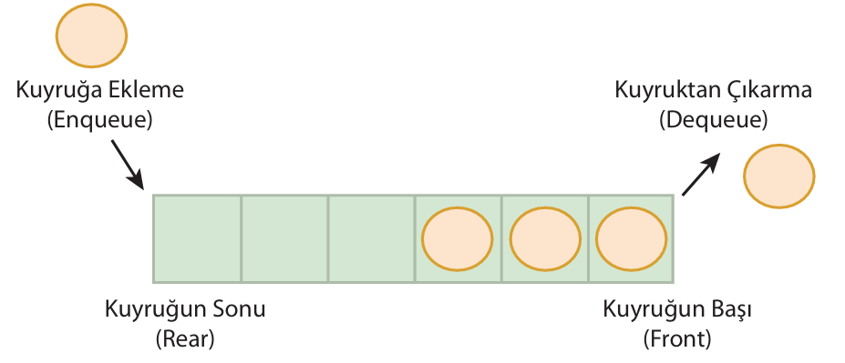

- Dizilerin kullanımı ile kuyruk programlama
- Bağlı Listelerin kullanımı ile kuyruk programlama

### Dizi ile Kuyruk Uygulaması

Bu yöntemde verileri tutacak bir diziye, kuyruğun başını takip edecek bir tamsayıya, kuyruuğun sonunu takip edecek bir tamsayıya ve kuyruktaki mevcut eleman sayısını gösterecek bir tamsayayıa ihtiyaç duyulur. Kuyruk veri yapısının tamsayı tipinde değerleri
saklayacağına varsayarsak:

- int queue[N]: Kuyruktaki elemanları tutacak N uzunluğunda tamsayı dizisi
- int front: kuyruğun başını gösteren indis
- int rear: Kuyruğun sonunu gösteren indis
- int count: kuyruktaki eleman sayısı

```C
#include <stdio.h>

#define     N   6

int queue[N];
int front = 0, rear = 0, count = 0;

void enqueue(int new)
{
    if(count == N)
    {
        printf("Kuyrukta yer yoktur!\n");
    }
    else
    {
        queue[rear] = new;
        rear++;
        if(rear == N)
        {
            rear = 0;
        }
        count++;
        printf("%d kuyruga eklendi.\n", new);
    }
}

void dequeue() 
{
    if(count == 0)
    {
        printf("Kuyrukta eleman yoktur.\n");
    }
    else
    {
        int removed = queue[front];
        front++;
        if(front == N)
        {
            front = 0;
        }
        count--;
        printf("%d kuyruktan cikarildi\n", removed);
    }
}

void printQueue(int queue[])
{
    printf("Queue: ");
    int idx = front;

    for (int i = 0; i < count; i++)
    {
        printf("%d ", queue[idx]);
        idx = (idx + 1) % N;
    }
    printf("\n");
}

int main(void)
{
    printQueue(queue);
    printf("\n---------------\n");

    enqueue(10);
    enqueue(20);
    enqueue(30);
    enqueue(40);
    enqueue(50);
    enqueue(60);

    printQueue(queue);
    printf("\n---------------\n");

    dequeue();
    printf("\n---------------\n");
    printQueue(queue);

    return 0;
}
```

### Bağlı Liste ile Kuyruk Uygulaması

Bu yöntemde bağlı listenin elemanlarını oluşturacak bir veri yapısına ve kuyruğun başını ve sonunu takip edecek göstericilere ihtiyaç duyulacaktır.

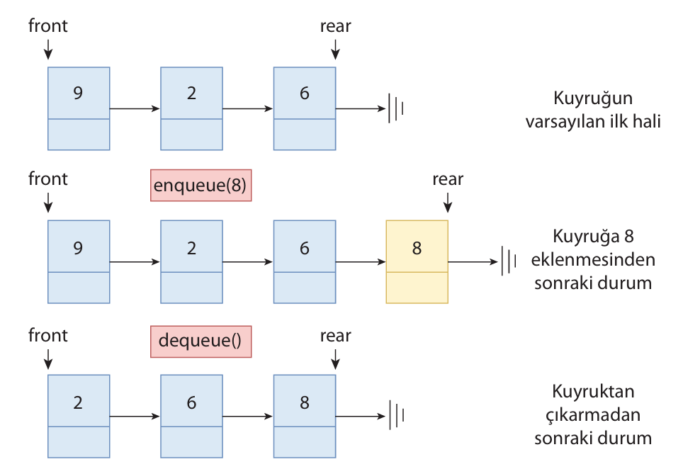

- struct Node: Bağlı listeyi oluştuıracak elemanlar için veri ypaısı
- struct Node* front: Kuyruğun başını ifade eden Node Gösterici
- struct Node* rear: Kuyruğun sonunu ifade eden Node Gösterici

```C
#include <stdio.h>
#include <stdlib.h>

struct Node
{
    int data;
    struct Node* next;
};

struct Node* front = NULL;
struct Node* rear = NULL;

void enqueue(int new)
{
    struct Node* newNode = (struct Node*) malloc(sizeof(struct Node));

    newNode->data = new;
    newNode->next = NULL;

    if(front == NULL && rear == NULL)
    {
        front = rear = newNode;
    }
    else
    {
        rear->next = newNode;
        rear = newNode;
    }

    printf("%d Kuyruga eklendi\n", new);
}

void dequeue()
{
    if(front == NULL)
    {
        printf("Kuyrukta eleman yoktur!\n");
    }
    else
    {
        struct Node* oldNode = front;
        
        if(front == rear)
        {
            front = rear = NULL;
        }
        else
        {
            front = front->next;
        }
        printf("%d kuyruktan cikarildi\n", oldNode->data);
        free(oldNode);
    }
}
```

### Örnek: Kuyruk Dizi

```C
#include <stdio.h>
#define N   5

int queue[N];
int front = 0, rear = 0, count = 0;

void enqueue(int newNum)
{
    if(count == N)
    {
        printf("Kuyruk Dolu! Yeni musteri alinamaz!\n");
    }
    else
    {
        queue[rear] = newNum;
        rear = (rear + 1) % N;
        count++;
        printf("Musteri #%d kuyruga eklendi.\n", newNum);
    }
}

void dequeue()
{
    if(count == 0)
    {
        printf("Kuyruk BOŞ! Cagiralacak musteri yok!\n");
    }
    else
    {
        int num = queue[front];
        front = (front + 1) % N;
        count--;
        printf("Musteri #%d cagrildi ve kuyruktan cikarildi.\n", num);
    }
}

void printQueue()
{
    printf("Mevcut Kuyruk: ");
    int idx = front;

    for (int i = 0; i < count; i++)
    {
        printf("%d ", queue[idx]);
        idx = (idx + 1) % N;
    }
    printf("\n");
}

int main(void)
{
    int choice, ticket = 100; // müşteri sırası için başlangıç numarası

    while (1)
    {
        printf("\n--- BANKA SIRA KUYRUGU ---\n");
        printf("1. Sira Al (enqueue)\n");
        printf("2. Siradakini Cagir (dequeue)\n");
        printf("3. Kuyrugu Goster\n");
        printf("4. Cikis\n");
        
        printf("Seciminiz: ");
        scanf("%d", &choice);

        if(choice == 1)
        {
            enqueue(ticket++);
        }
        else if(choice == 2)
        {
            dequeue();
        }
        else if(choice == 3)
        {
            printQueue();
        }
        else if(choice == 4)
        {
            printf("Programdan cikiliyor...\n");
            break;
        }
        else
        {
            printf("Gecersiz Secim!\n");
        }
    }
    return 0;
}
```

## Yığınlar (Stacks)

Nesnelerin üst üste dizlimi, günlük hayatta olduğu gibi programlamada da var olan bir gereksinimdir. Bu ihtiyaç, yığın (stack)
adı verilen veri yapıları ile karşılanır. Yığın, verilerin doğrusal bir şekilde tutulduğu, ekleme ve çıkarma işlemlerinin en üst noktadan yapıldığı bir veri yapısıdır. Eklenen veri, yığının en üst noktasına saklanırken çıkarılan veri de yıuğının en üst noktasından alınır. Yığının en üst noktasının takibi, yığının tepe noktası (top) aracılığıyla sağlanır. 

LIFO: Last-In First-Out --> Programlamada yığınlar (stacks) LIFO kuralı ile anılır. Bu ifade Son giren ilk çıkar şeklinde
tercüme edilir.

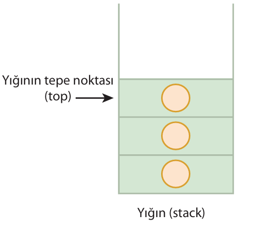

Yığınlar üzerinde yapılan temel işlemler ekleme (push), eleman çıkarma (pop) ve en üstteki elemanı elde etmektir (peek). Pop işleminde en üsttenki eleman yığından çıkarılırken, peek işleminde yalnızca bu elemanın değeri elde edilir, eleman yığından çıkarılmaz. Bu işlemlerin yanı sıra yığının doluluk kontrolü (isFull) ve yığının boşluk kontrolü (isEmpty) gibi yardımcı fonksiyonlar da kullanılabilir. 

- Dizilerin kullanımı ile yığın programlama
- Bağlı listelerin kullanımı ile yığın programlama

### Dizi ile Yığın Uygulaması

- int stack[N]: Yığındaki elemanları tutacak N uzunluğunda tamsayı dizisi
- int top: Yığının tepe noktasını gösteren indis

```C
#include <stdio.h>

#define N   10  

int stack[N];
int top = -1;

void push(int newVal)
{
    if(top == N-1)
    {
        printf("Stack DOLU! Eleman eklenemez. \n");
    }
    else
    {
        stack[++top] = newVal;
        printf("%d stack'e eklendi.\n", newVal);
    }
}

void pop()
{
    if(top == -1)
    {
        printf("Stack BOS! Eleman Cikarilamaz!\n");
    }
    else
    {
        int val = stack[top--];
        printf("%d stack'ten cikarildi.\n", val);
    }
    
}

void peek()
{
    if(top == -1)
    {
        printf("Stack BOS! Tepe eleman yok.\n");
    }
    else
    {
        printf("Stack'in tepe elemani: %d\n", stack[top]);
    }
    
}

void printStack()
{
    printf("Stack Icerigi (tepe -> taban): ");

    for (int i = top; i >= 0; i--)
    {
        printf("%d ", stack[i]);
    }
    printf("\n");
}

int main()
{
    int choice, newValue;
    
    while (1)
    {
        printf("\n--- STACK MENUSU ---\n");
        printf("1. Push (Ekle)\n");
        printf("2. Pop  (Cikar)\n");
        printf("3. Peek (Tepeyi Gor)\n");
        printf("4. Stack Yazdir\n");
        printf("5. Cikis\n");

        printf("Seciminiz: ");
        scanf("%d", &choice);

        if(choice == 1)
        {
            printf("Eklemek istediginiz degeri girin: ");
            scanf("%d", &newValue);
            push(newValue);
        }
        else if (choice == 2)
        {
            pop();
        }
        else if(choice == 3)
        {
            peek();
        }
        else if(choice == 4)
        {
            printStack();
        }
        else if(choice == 5)
        {
            printf("Programdan cikiliyor...\n");
            break;
        }
        else
        {
            printf("Gecersiz secim!\n");
        }
    }
    

    return 0;
}
```

### Bağlı Liste ile Yığın Uygulaması

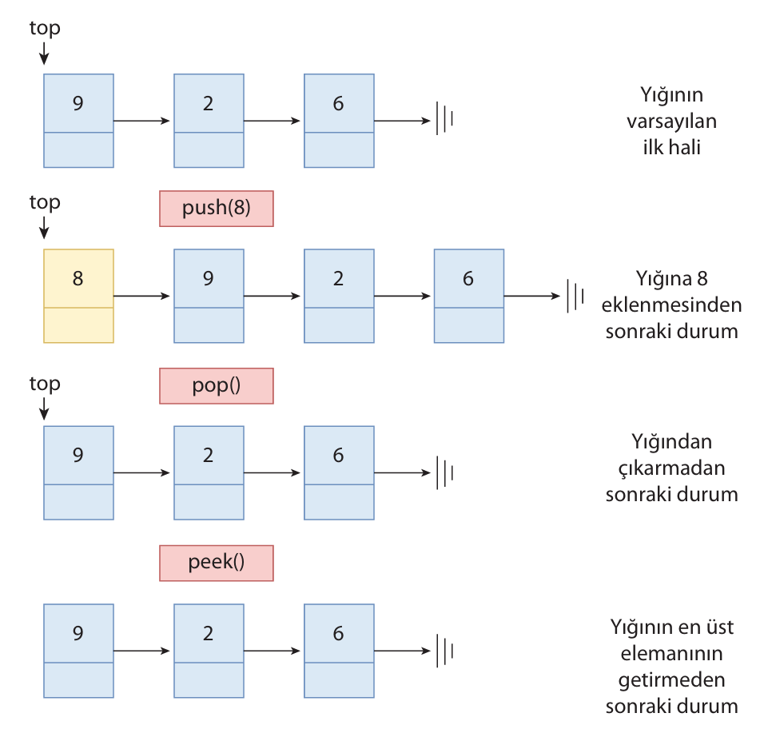

```C
#include <stdio.h>
#include <stdlib.h>

typedef struct Node {
    int data;
    struct Node* next;
} Node;

Node* top = NULL; // Stack'in tepe (top) düğümü

void push(int newVal)
{
    Node* newNode = (Node *)malloc(sizeof(Node));

    if (!newNode)
    {
        printf("Bellek Yetersiz! Eleman eklenemedi.\n");
        return;
    }

    newNode->data = newVal;
    newNode->next = top;
    top = newNode;
    
    printf("%d stack'e eklendi.\n", newVal);
}

void pop()
{
    if (top == NULL)
    {
        printf("Stack BOS! Eleman cikarilamaz.\n");
    }
    else
    {
        Node* temp = top;
        printf("%d stack'ten cikarildi.\n", temp->data);
        top = top->next;
        free(temp);
    }
}

void peek()
{
    if (top == NULL)
    {
        printf("Stack BOS! Tepe eleman yok.\n");
    }
    else
    {
        printf("Stack'in tepe elemani: %d\n", top->data);
    }
}

void printStack()
{
    printf("Stack icerigi (tepe -> taban): ");
    Node* curr = top;

    while (curr)
    {
        printf("%d ", curr->data);
        curr = curr->next;
    }
    printf("\n");
}

void freeStack()
{
    while (top != NULL)
    {
        pop();
    }
}

int main()
{
    int choice, newValue;
    
    while (1)
    {
        printf("\n--- STACK MENUSU ---\n");
        printf("1. Push (Ekle)\n");
        printf("2. Pop  (Cikar)\n");
        printf("3. Peek (Tepeyi Gor)\n");
        printf("4. Stack Yazdir\n");
        printf("5. Cikis\n");

        printf("Seciminiz: ");
        scanf("%d", &choice);

        if(choice == 1)
        {
            printf("Eklemek istediginiz degeri girin: ");
            scanf("%d", &newValue);
            push(newValue);
        }
        else if (choice == 2)
        {
            pop();
        }
        else if(choice == 3)
        {
            peek();
        }
        else if(choice == 4)
        {
            printStack();
        }
        else if(choice == 5)
        {
            printf("Programdan cikiliyor...\n");
            freeStack();
            break;
        }
        else
        {
            printf("Gecersiz secim!\n");
        }
    }
    

    return 0;
}
```

```bash
--- STACK (Linked List) MENÜSÜ ---
1. Push (Ekle)
2. Pop (Çıkar)
3. Peek (Tepeyi Gör)
4. Stack'i Yazdır
5. Çıkış
Seçiminiz: 1
Eklemek istediğiniz değeri girin: 12
12 stack'e eklendi.

Seçiminiz: 1
Eklemek istediğiniz değeri girin: 45
45 stack'e eklendi.

Seçiminiz: 4
Stack içeriği (tepe -> taban): 45 12

Seçiminiz: 2
45 stack'ten çıkarıldı.
```


## Ağaçlar (Trees)

Ağaç veri yapısı, verilerin birbirlerine temsili bir ağaç oluşturacak şekilde bağlandığı hiyerarşik bir veri moedilidir.
Bir ağaç düğümlerden ve düğümleri birbirine bğalayan dallardan meydana gelir. Ağaç veri yapısı, çizge veri yapısının bir alt kümesidir. 

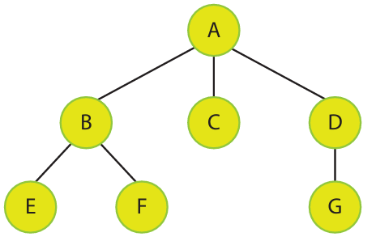

- Kök (root): Bir ağacın en üst noktasında bulunan düğümdür.
- Dal (Edge): Düğümleri birbirine bğalayan kenara verilen isimdir.
- Yol (Path): Birbirleri ile bağlantılı dal dizisine yol adı verilir.
- Ebeveyn (parent): Bir düğümden önce yer alan ve o düğüme bir dal ile bağlı olan düğüme ebeveyn denir. Kök hariç her düğümün bir ebeveyni bulunmaktadır.
- Çocuk (child): Bir düğümden sonra yer alan ve o düğüme bir dal ile bağlı olan düğüm/düğümlere çocuk denir.

Bir ağaç veri yapısı, sahip olduğu özellikler ile farklı kategorilere ayrılabilir. 

- İkili Ağaçlar
- İkili Arama Ağaçları
- AVL ağaçları

### İkili Ağaçlar (Binary Trees)

İkili ağaçlar, her bir düğümün en fazla 2 çocuğa sahip olabildiği ağaç türüdür. Bu veri yapısında ekleme, silme ve arama işlemşeri çok hızlı bir şekilde yapılabilmektedir. 

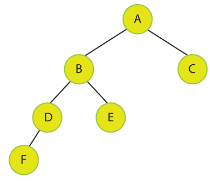

```C
#include <stdio.h>
#include <stdlib.h>
#include <conio.h>

// Ağacın düğüm yapısı
typedef struct Node {
    int data;
    struct Node* left;
    struct Node* right;
} Node;

Node* createNode(int value)
{
    Node* newNode = (Node *)malloc(sizeof(Node));

    newNode->data = value;
    newNode->left = NULL;
    newNode->right = NULL;

    return newNode;
}

void printTree(Node* root)
{
    if(root != NULL)
    {
        printf("%d ", root->data);
        printTree(root->left);
        printTree(root->right);
    }
}

int main()
{
    Node* root = createNode(5);

    root->left = createNode(6);
    root->right = createNode(8);

    printTree(root);
    getch();

    return 0;
}
```

### İkili Ağaçlarda Gezinme Yöntemleri

Bir bilgisayar programındaki ağaç veri yapsında gezinmenin düğümlerde arama yapma, düğümleri kullanıcıya gösterme, düğüm değerlerini ekrana yazdırma gibi çeşitli sebepleri olabilir.

İkili ağaç veri yapısın kendi içerisinde alt ağaçlardan meydana geldiği için, ikili ağaçları gezinmede özyinelemeli fonksiyonlar kullanılır. İkili ağaçlardaki düğümler dolaşıulırken farklı yöntemler uyuglanabilirken bilgisayar programında bu işi yapabilmek için kabul görmüş üç gezinme yöntemi vardır:

1. Preorder Gezinme (Kök başta)
2. Inorder Gezinme (Kök ortada)
3. Postorder Gezinme (Kök sonda)

#### 1. Preorder Gezinme (Kök başta)

Öncelikle kök, daha sonrasında sol alt ağaç, en son olarak da sağ alt ağaç üzerinde gezinme yapılır. Root - Left - Right

```C
void preOrder(Node* root)
{
    if (root != NULL)
    {
        printf("%d ", root->data);
        preOrder(root->left);
        preOrder(root->right);
    }
}
```

Yukarıdaki şekilde gösterilen ikili ağaç bu yöntemle gezildiğinde ekrana yazdırılan düğüm değerleri sırasıyla A, B, D, F, E, C olur.


#### 2. Inorder Gezinme (Kök ortada)

Öncelikle sol alt ağaç, daha sonrasında kök, en son olarak da sağ alt ağaç üzerinde gezinme yapılır. Left - Root - Right

```C
void inOrder(Node* root)
{
    if (root != NULL)
    {
        inOrder(root->left);
        printf("%d ", root->data);
        inOrder(root->right);
    }
}
```

Yukarıdaki şekilde gösterilen ikili ağaç bu yöntemle gezildiğinde ekrana yazdırılan düğüm değerleri sırasıyla F, D, B, E, A, C olur.

#### 2. PostOrder Gezinme (Kök Sağda)

Öncelikle sol alt ağaç daha sonrasında sağ alt ağaç, en son olarak da kök üzerinde gezinme yapılır. Left - Right - Root

```C
void postOrder(Node* root)
{
    if (root != NULL)
    {
        postOrder(root->left);
        postOrder(root->right);
        printf("%d ", root->data);
    }
}
```

Yukarıdaki şekilde gösterilen ikili ağaç bu yöntemle gezildiğinde ekrana yazdırılan düğüm değerleri sırasıyla F, D, E, B, C, A olur.

##### Örnek:

```C
#include <stdio.h>
#include <stdlib.h>
#include <conio.h>

// Ağacın düğüm yapısı
typedef struct Node {
    int data;
    struct Node* left;
    struct Node* right;
} Node;

Node* createNode(int value)
{
    Node* newNode = (Node *)malloc(sizeof(Node));

    newNode->data = value;
    newNode->left = NULL;
    newNode->right = NULL;

    return newNode;
}

Node* insert(Node* root, int data)
{
    if(root == NULL)
        return createNode(data);
    
    if(data < root->data)
    {
        root->left = insert(root->left, data);
    }
    else if(data > root->data)
    {
        root->right = insert(root->right, data);
    }
    
    return root;
}

void inorder(Node* root)
{
    if(root != NULL)
    {
        inorder(root->left);
        printf("%d ", root->data);
        inorder(root->right);
    }
}

void preOrder(Node* root)
{
    if(root != NULL)
    {
        printf("%d ", root->data);
        preOrder(root->left);
        preOrder(root->right);
    }
}

void postOrder(Node* root)
{
    if(root != NULL)
    {
        postOrder(root->left);
        postOrder(root->right);
        printf("%d ", root->data);
    }
}

void printTree(Node* root)
{
    if(root != NULL)
    {
        printf("%d ", root->data);
        printTree(root->left);
        printTree(root->right);
    }
}

int main()
{
    Node* root = NULL;

    // Create tree
    root = insert(root, 50);
    insert(root, 30);
    insert(root, 70);
    insert(root, 20);
    insert(root, 40);
    insert(root, 60);
    insert(root, 80);

    printf("Inorder: ");
    inorder(root); // 20, 30, 40, 50, 60, 70, 80
    printf("\n");

    printf("Preorder: ");
    preOrder(root); // 50 30 20 40 70 60 80
    printf("\n");

    printf("Postorder: "),
    postOrder(root); // 20 40 30 60 80 70 50 
    printf("\n");

    return 0;
}
```

                50
        30              70
    20     40       60      80

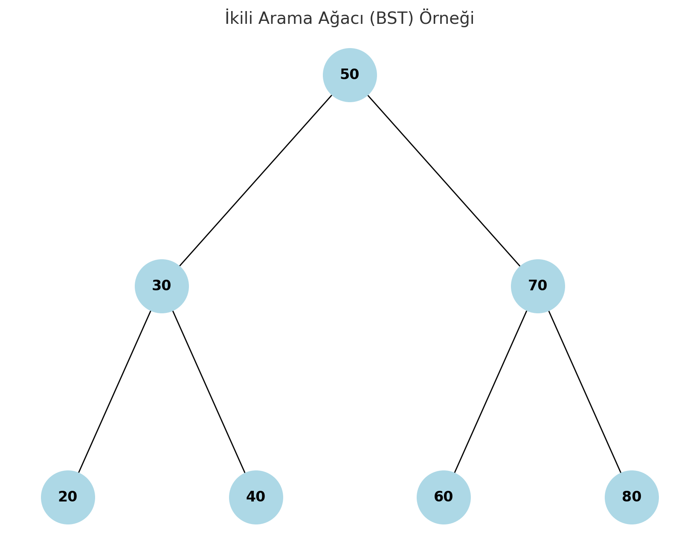

### İkili Arama Ağaçları

İkili ağaç özelliklerine ek olarak düğümlerde yer alan veriler arasında büyüklük-küçüklük ilişkisi bulunmaktadır. İkili ağaç özellikleri taşıyan bir ağacın ikili arama ağacı olabilmesi için ağaçtaki her düğümün, sol alt ağaxındaki tüm değerlerde büyük olması, sağ alt ağacındaki tüm değerlerden küçük veya eşit olması gerekir. 

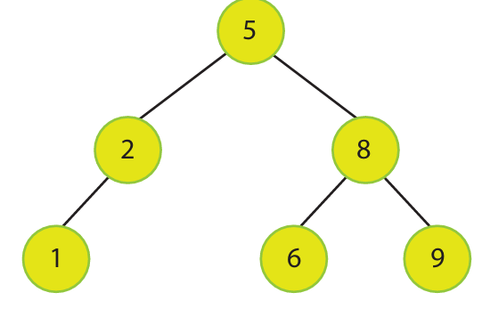

#### İkili Arama Ağacından Düğüm Çıkarma

İkili arama ağacından düğüm çıkarma için öncelikle düğümün ağaçta bulunması gerekir. Düğüm ağaçta yer alıyorsa ikili arama ağacı özellikleri korunarak çıkarma işlemi gerçekleştirilir.

1. Çıkarılacak düğümün çocuğu yok ise; düğümün ebeveyninin ilgili göstericisi (left verya right) NULL yapılır, düğüm hafızadan silinir.


2. Çıkarılan düğümün 1 çocuğu var ise; düğümün çocuğundan itibaren alt ağaç düğümünün ebeveynine bağlanır. Düğüm hafızadan silinir.

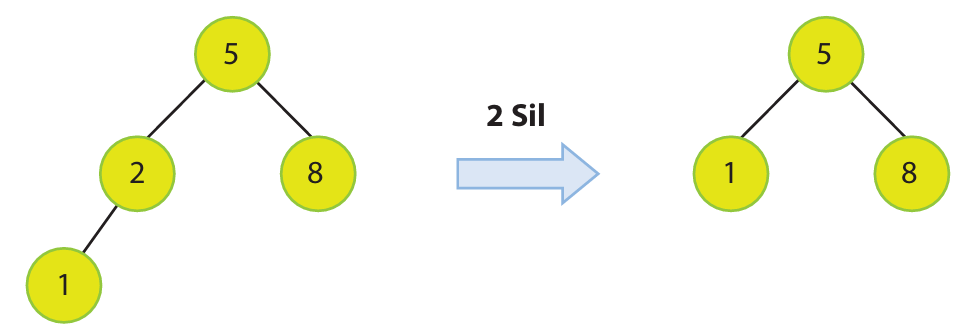

3. Çıkarılan düğümün 2 çocuğu var ise düğümün sağ alt ağacındaki en küçük değerli düğümü bulunur, bulunan düğüm ile çıkarılacak düğüm yer değiştirilir, düğüm hafızadan silinir.

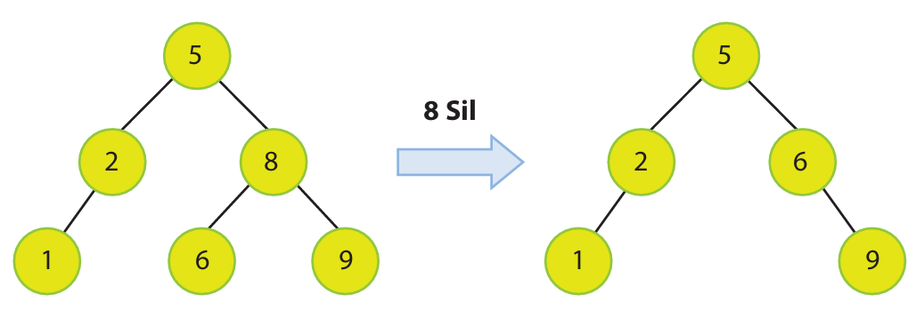

#### ÖDEV:
İkili arama ağacından düğüm çıkarma işlemlerini yapan bir çıkarma fonksiyonu geliştirin. Program yukarıdaki örnekten temel alıp bu örnek üzerinden kod geliştirme yapabilirisniiz. Programda ağaca düğüm ekleme, ağaçtan düğüm çıkarma ve ağacı ekrana yazdırma fonksiyonlarını deneyip sonuçlarını gösterin.

### AVL Ağaçları

İkili ağaçlarda ve ikili arama ağaçlarında ağacın yüksekliği için herhangi bir ölçüt bulunmamaktadır. N adet düğüme sahip bir ikili ağacın yüksekliği en fazla N-1 olabilir. Bu ağaçlarda yükseklik içni bir kısıtlama olmaması, ağaç içierisindeki düğümlerin dengesiz dağılmasına sebep olabilir. Başka bir ifadeyle, sol alt ağaç ile sağ alt ağaç arasındaki yükseklif farkı 1'den fazla olabilir.

AVL (Adelson - Velsky - Landis) ağaçları, ikili arama ağaçlarının özel bir türüdür. Bu veri yapısında ağaç içerisindeki denge korunmakta, sol alt ağaç ile sağ alt ağaç arasındaki yükseklif farkı en fazla 1 olabilmektedir. 

AVL ağaçlarındaki düğümler içni denge faktörü bir formül ile hesaplanır ve dengeli bir ağaç için bu değerler yalnızca -1, 0, ve 1 olabilir.

    b =  hleft - hright

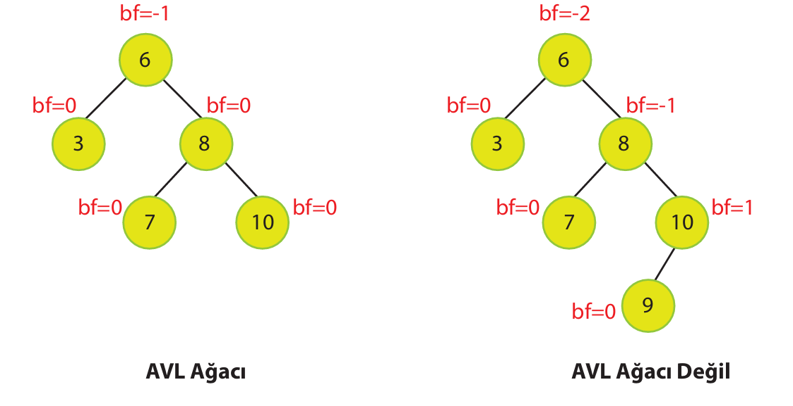

#### ÖDEV:

- AVL ağaçlarında düğüm ekleme ve düğüm çıkarma işlemlerini araştır.
- Yığın Ağaçlarını araştır.


## Geri Kalan Konular
- ÖZETLEME (HASH) Tabloları
- Algoritma Tasarımı
    - Döngü Algoritmaları
    - Küçült-Fethet Yöntemi
    - Böl-Fethet Yöntemi
- Algoritma Analizi
    - Asimpotik Gösterimler
    - Özyinelemeli fonksiyonlar
    - Çalışma zamanı
    - Zaman karmaşıklığı
- Arama Algoritmaları
    - Arama
    - Ardışık Arama
    - İkili Arama
- Sıralama Algoritmaları
    - Sıralama
    - Temel sıralama algoritmaları
    - Zaman karmaşıklığı
- Çizge Algoritmaları (Graph)
    - Yönsüz çizge
    - Yönlü çizge
    .....

    
